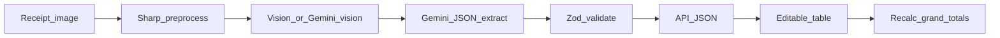

# BIR-style receipt OCR: JSON schema + editable table

## Current state (repo facts)

- Pipeline: `[src/helpers/receipt-ocr-pipeline.ts](src/helpers/receipt-ocr-pipeline.ts)` → Vision `[extractReceiptTextWithVision](src/services/vision-ocr-service.ts)` → `[parseReceiptText](src/helpers/receipt-text-parser.ts)`, which **only** returns `rawLines` (`[ParsedReceiptText](src/types/types.ts)`).
- UI: `[ReceiptOcrWorkbench](src/features/ocr/components/receipt-ocr-workbench.tsx)` shows raw lines + metadata, **no** tabular BIR layout.
- Dependencies: `[package.json](package.json)` includes `@google-cloud/vision` only—**no Gemini client** wired yet (worth aligning code with your “Gemini Vision” goal).
- `[requirements/bir/745726807P062025.RLF](requirements/bir/745726807P062025.RLF)`: content is **binary / non-UTF8 text**, not a usable JSON template in-app. BIR RLF is typically a proprietary export; **do not** treat it as the OCR JSON contract unless you obtain an official format spec. OCR + UI can still mirror the **on-screen “Purchases Inquiry” columns and grand totals** from your reference screenshots.

## Target UX (from your screenshots)

- A **main grid** with identity/location columns (e.g. sequence, TIN, registered name, optional name parts, address fields) and **amount columns** (e.g. per-row exempt, zero-rated, taxable net of VAT, optional detail columns, input tax—exact column set should match what you need for filing, not every column from every partial screenshot).
- A **Grand Total** footer: Exempt, Zero-Rated, Taxable (Net of VAT), Total Purchase, Total Input Tax.
- **Editable cells** so users can fix OCR mistakes before export/copy.
- **Server response** includes a **structured JSON body** (not only `rawLines`).

## Recommended extraction architecture (Gemini)

Two viable patterns—pick one during implementation (both satisfy “Gemini Vision”):

1. **Multimodal Gemini (image + short prompt)**

- Single call returns strict JSON matching your schema (best when layout varies a lot).

1. **Vision OCR (existing) + Gemini text-only JSON**

- Keeps current Google Vision OCR; Gemini receives `rawText` + optional line list and returns JSON (often cheaper; good if text quality is already high).

**Guardrails:** JSON schema / Zod validation on the server, sensible defaults for missing fields, and always return `text` or `rawLines` alongside structured data for transparency.

**Files likely touched:** new service under `[src/services/](src/services/)` (e.g. `gemini-receipt-structured-extract.ts`), pipeline update in `[src/helpers/receipt-ocr-pipeline.ts](src/helpers/receipt-ocr-pipeline.ts)`, env var(s) for Gemini API key, types in `[src/types/types.ts](src/types/types.ts)` and client types in `[src/features/ocr/types.ts](src/features/ocr/types.ts)`.

## JSON shape (concrete, versioned)

Introduce a **versioned** wrapper so you can evolve fields without breaking clients, e.g.:

- `schemaVersion: "1"`
- `company` (optional): taxpayer context if ever needed
- `lineItems[]`: each row = one receipt’s mapped purchase line (usually **one row per uploaded receipt** unless you later split multi-line SI details)
  - `sequence`, `tin`, `registeredName`, `lastName` (optional), address parts (strings as needed), numeric fields as **numbers** (not formatted strings): `exempt`, `zeroRated`, `taxableNetOfVat`, `totalPurchase`, `inputTax`, plus any extra columns you require (e.g. capital goods) as optional.
- `totals`: same five aggregates as the footer; **either** extracted **or** computed from `lineItems` with clear rules (document in code: e.g. totals = sum of rows unless user overrides footer).

Store **canonical numbers** in JSON; format with commas only in the UI.

## Frontend

- New presentational component (e.g. `bir-purchases-inquiry-table.tsx` under `[src/features/ocr/components/](src/features/ocr/components/)`) using existing UI primitives (`[Button](src/components/ui/button.tsx)`, etc.).
- **Controlled state** for `lineItems` and `totals`; on cell blur/change, **recompute** footer sums (and optionally flag when footer was manually overridden).
- Keep `[RawOutputCard](src/features/ocr/components/raw-output-card.tsx)` or a collapsible “Raw OCR” section so power users still see `[useReceiptOcr](src/features/ocr/hooks/use-receipt-ocr.ts)` raw output.

## Sample receipts and tuning

- Use images under `requirements/bir/sample receipts/` (and your `1.jpeg`–`5.jpeg`) as **fixture prompts**: iterate Gemini instructions and validation until TIN/amounts stabilize. The folder was **not** present in the last workspace scan—once files exist locally, add a small **manual regression checklist** (no new markdown file unless you want it; can be comments in tests or a short in-code list).

## Security and API design

- **Never** send Gemini API keys to the browser; extraction stays **server-side** in `[src/app/api/ocr/route.ts](src/app/api/ocr/route.ts)` or a dedicated route (e.g. `/api/ocr/structured`) if you prefer separation.
- Validate uploads as today (`[validateReceiptUpload](src/validations/validation.ts)`).
- Cap image size / rate-limit if exposing publicly (future hardening).

## Out of scope (unless you add specs)

- Parsing `**.RLF` into this JSON (needs official BIR format documentation).
- Automatic **submission** to BIR eFPS/eLORI—this plan stops at **human-verified JSON + editable UI**.
