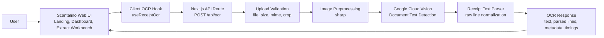

# Scantalino

Scantalino is a receipt OCR web application built with Next.js, React, and Google Cloud Vision. It provides a polished operator-facing workflow for uploading or capturing receipt images, preprocessing them on the server, extracting text through Google Vision OCR, and reviewing normalized raw lines with extraction metadata.

## Overview

Scantalino is organized around a simple workflow:

1. Capture or upload a receipt image from the extraction workspace.
2. Validate the request and preprocess the image for OCR accuracy.
3. Send the processed image to Google Cloud Vision.
4. Normalize the OCR output into reviewable raw lines.
5. Display extraction metadata and pipeline timings in the dashboard UI.

The product includes:

- A marketing landing page and pricing surface
- Sign-in and sign-up screens
- A dashboard shell with overview, extract, profile, settings, and notifications pages
- A receipt extraction workbench with upload and device-camera capture support
- A Node.js API route for receipt OCR processing

## Key Capabilities

- Receipt OCR pipeline exposed through `POST /api/ocr`
- Image preprocessing with `sharp` for rotation, flattening, grayscale conversion, normalization, optional sharpening, resizing, and cropping
- Google Cloud Vision integration using `documentTextDetection`
- Upload validation for file presence, file size, MIME type, and crop payload correctness
- Structured OCR response including raw extracted text, normalized raw lines, image metadata, OCR metadata, and timing metrics
- Client-side image optimization before upload
- Dashboard-oriented UX for reviewing extraction output inside an authenticated-looking application shell

## Technology Stack

- Next.js 16 App Router
- React 19
- TypeScript
- Tailwind CSS 4
- Google Cloud Vision API
- `sharp` for image preprocessing
- Framer Motion for motion and landing page presentation
- Recharts for dashboard visualization
- Sileo for toast and async interaction feedback

## Architecture



## Project Structure

```text
src/
  app/
    api/ocr/route.ts              # OCR API endpoint
    dashboard/                    # Dashboard pages and layout
    extract/page.tsx              # Redirect to dashboard extractor
    page.tsx                      # Landing page
    pricing/                      # Pricing page
    sign-in/ and sign-up/         # Entry screens
  components/                     # Shared UI, layout, and providers
  features/
    home/                         # Marketing and landing experience
    dashboard/                    # Dashboard widgets and sample data
    ocr/                          # OCR workbench, hooks, client API, utilities
    profile/                      # Profile view components and data
  helpers/
    image-preprocessing.ts        # Server-side image optimization pipeline
    receipt-ocr-pipeline.ts       # End-to-end OCR orchestration
    receipt-text-parser.ts        # Raw line normalization
  services/
    vision-ocr-service.ts         # Google Vision client integration
  validations/
    validation.ts                 # Request and upload validation
```

## OCR Request Flow

The OCR endpoint accepts `multipart/form-data` with a required `file` field.

Supported file types:

- JPEG
- PNG
- WEBP
- TIFF

Server-side processing flow:

1. Verify the request content type is `multipart/form-data`.
2. Validate file existence, size, and detected MIME type.
3. Optionally validate and apply a crop region.
4. Preprocess the image into an OCR-friendly JPEG.
5. Send the processed image to Google Vision.
6. Split extracted text into normalized non-empty raw lines.
7. Return text, parsed output, image metadata, OCR metadata, and timing metrics.

## Environment Variables

Scantalino depends on the following environment variables:

- `GOOGLE_APPLICATION_CREDENTIALS`
  Accepts either a path recognized by Google client libraries or an inline service-account JSON string.
- `OCR_MAX_FILE_SIZE_BYTES`
  Optional override for the maximum upload size. Defaults to `10485760` bytes.
- `OCR_PREPROCESSING_PROFILE`
  Optional preprocessing mode. Supported values are `fast` and `quality`.

## Local Development

Install dependencies:

```bash
pnpm install
```

Start the development server:

```bash
pnpm dev
```

Build for production:

```bash
pnpm build
pnpm start
```

Lint the project:

```bash
pnpm lint
```

Default local URL:

```text
http://localhost:3000
```

## API Contract

### `POST /api/ocr`

Request:

- Content type: `multipart/form-data`
- Required field: `file`
- Optional crop input:
  - `crop` as JSON string with `left`, `top`, `width`, `height`
  - or `cropLeft`, `cropTop`, `cropWidth`, `cropHeight`

Successful response includes:

- `text`
- `parsed.rawLines`
- `metadata.image`
- `metadata.ocr`
- `metadata.timingsMs`

Error responses return a normalized payload:

```json
{
  "error": {
    "code": "ERROR_CODE",
    "message": "Human-readable message",
    "details": {}
  }
}
```

## Deployment Notes

- The OCR route runs on the Node.js runtime.
- Google Cloud Vision credentials must be available in the deployment environment.
- `vercel.json` currently rewrites all routes to `/`, which should be reviewed carefully before production deployment because it may interfere with application routing and API behavior depending on the hosting setup.

## Current Scope

The current OCR parser normalizes extracted text into raw lines for review. It does not yet implement deeper receipt field extraction such as merchant name, totals, taxes, or line-item structuring.

## License

This repository is private and does not currently declare a public license.
